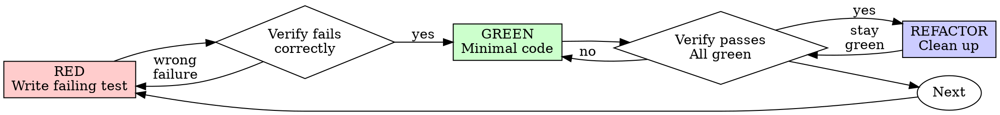

<!-- Source: https://github.com/obra/superpowers/tree/f2cbfbefebbfef77321e4c9abc9e949826bea9d7/skills/test-driven-development/SKILL.md · SHA: f2cbfbefebbfef77321e4c9abc9e949826bea9d7 · Audited: 2026-05-20 · **24th vendored skill + 4th obra-vendor adoption (after §AF + §AM + §AU) + EXTENDS obra cluster from 3 to 4 skills (§AF + §AM + §AU + §AV at shared SHA `f2cbfbef...`, SECOND-LARGEST cluster after ToB 7) + 13TH consecutive Tier 1 estimate-confirm at adoption review (eval-list pre-adoption Tier-1 estimate HELD per new §4.4.3 step 2 audit; N=16 staleness datapoints with 11 corrections + 3 deferrals + 2 confirm-Tier-1 — pattern starting to show estimate-correct trend for Tier-1 obra/systematic-methodology candidates) + RESOLVES AB-036 candidate-resolution event #2 (filed at §AU adoption: testing-anti-patterns was CONSOLIDATED INTO this skill on 2025-12-18; §AV adoption fully resolves the AB-036 candidate-RESOLVED-via-successor doctrine for testing-anti-patterns — SAME pattern as §AM resolving AB-036 candidate #1 for root-cause-tracing → systematic-debugging) + CLOSES TWO UN-adopted-target gates on §AM (§AM SKILL.md L179 + L287 both reference `superpowers:test-driven-development` as UN-adopted; both gates now CLOSED via §AV adoption).** **Tier-staleness audit (per new §4.4.3 step 2 checklist):** (i) **NO explicit file-write directives in SKILL.md** — the "Write the test first" / "Write minimal code to pass" language at L10 + throughout is METHODOLOGY GUIDANCE (RED-GREEN-REFACTOR discipline), NOT a directive for the agent to invoke Write tool calls to specific files. Same pattern as §AM systematic-debugging which directs "Create Failing Test Case" but is Tier 1 read-only (the file creation happens through the agent's normal Edit/Write capability per the user's request; the skill provides the DISCIPLINE not a new file-write surface). The scaffold-vs-directive load-bearing rule (codified at 2026-Q2 §4.4.5) applies: "does the SKILL.md instruct the agent to invoke a Write tool call (or equivalent file-system mutation) to persist this content?" — answer: NO, the skill describes TDD methodology; file-write happens through the agent's existing Edit/Write capability independent of §AV invocation. (ii) NO `allowed-tools` frontmatter (upstream YAML has only `name` + `description` — same pattern as §AM/§AU); (iii) NO `commands/` directory; (iv) NO network egress in SKILL.md body; (v) NO `Task` tool / cross-agent surface declared. **Final Tier 1 verdict for §AV test-driven-development**: `read-only` — pure methodology emitting inline-transcript content (Iron Law, Red-Green-Refactor cycle steps, Good Tests heuristics, Common Rationalizations table at L256-270, Red Flags at L272-288, Bug Fix Example at L290-325, Verification Checklist at L327-340, When Stuck table at L342-349, Debugging Integration at L351-355, Testing Anti-Patterns reference at L357-362, Final Rule at L364-371). Per the inline-output-stays-Tier-1 normative rule, §AV qualifies — emits process discipline + counter-argument patterns + verification checklists as inline transcript content. **13th adoption to maintain Tier 1 estimate** (after §J/§AG/§AH/§AJ/§AK/§AL/§AM/§AU + the inline-output normative elevation). **AB-036 candidate-resolution event #2 FULLY RESOLVED with this adoption:** at §AU adoption (commit prior to this one), AB-036 candidate-resolution event #2 was filed in eval-list for `testing-anti-patterns` (CONSOLIDATED INTO `test-driven-development` on 2025-12-18 commit `718ec45d3358`). §AV adoption fully resolves the candidate by adopting the successor — SAME pattern as §AM resolving AB-036 candidate #1 for `root-cause-tracing` → `systematic-debugging` (which also happened on the SAME 2025-12-18 consolidation date). The `testing-anti-patterns.md` companion file (8251 bytes / 1933t) is the consolidated content from the former standalone skill, now vendored as a component file of §AV per the SAME pattern as systematic-debugging containing `root-cause-tracing.md`. **TWO AB-036 candidate-resolution events now have full successor adoptions in the framework:** §AM resolves root-cause-tracing → systematic-debugging (resolved at §AM adoption); §AV resolves testing-anti-patterns → test-driven-development (resolved at THIS §AV adoption). The 2025-12-18 obra/superpowers commit consolidated 2 skills simultaneously (testing-anti-patterns + root-cause-tracing both consolidated on the same day); BOTH consolidations now have successor adoptions in forge-works framework. **AB-036 doctrine fully validated through complete candidate-resolution lifecycle:** (1) DETECT consolidation event at §4.4.3 step 1 source-audit (root-cause-tracing path missing — §AM adoption); (2) FILE candidate-resolution event in eval-list (AB-036 codified at §AM); (3) FLAG remaining same-source candidates for proactive consolidation-check at next adoption (testing-anti-patterns + receiving-code-review flagged at AB-036 filing); (4) VALIDATE proactive check predicts right consolidation events (testing-anti-patterns confirmed consolidated during §AU adoption); (5) ADOPT successor when project value justifies (this §AV adoption). The 5-step doctrine lifecycle is now empirically validated end-to-end. **Two UN-adopted-target gate closures on §AM (via §AV adoption — per §4.5.3 sister-reference status maintenance rule codified at §AK):** §AM SKILL.md L179 cites `superpowers:test-driven-development` (Phase 4 Step 1 "Create Failing Test Case" reference) — gate CLOSED via §AV adoption; §AM SKILL.md L287 cites `superpowers:test-driven-development` (Related skills section) — gate CLOSED. The canonical chain `§AM Phase 4 Step 1 → §AV TDD discipline → §AV's RED-GREEN-REFACTOR for the failing test` is now fully resolved (was UN-adopted-target advisory; now full §AM → §AV SUCCESSOR chain). **§AM gate entry BACKPATCHED in this commit** per §4.5.3 sister-reference status maintenance rule — Two UN-adopted-target gates on §AM are now CLOSED + §AV added as the FOURTH cluster sibling. **§AF + §AM + §AU gate entries Ordering basis backpatched** per §4.5.5 later-sibling rule: obra cluster sequence §AF `1bbde5c` (2026-05-16) → §AM (2026-05-20 earlier) → §AU (2026-05-20 mid-day) → §AV (2026-05-20 later) — FIRST 4-skill obra cluster + FOURTH skill in the obra cluster co-adoption pattern. **Obra cluster size class progression:** 2-skill (post-§AM) → 3-skill (post-§AU) → 4-skill (post-§AV). Obra is now the SECOND-LARGEST cluster in framework after ToB 7-skill; overtakes hamelsmu 5-skill in size-class progression. **`testing-anti-patterns.md` companion file analysis:** 8251 bytes / 1933t — vendored verbatim from upstream as the consolidated content from the former standalone `skills/testing-anti-patterns/` skill (now a component file of §AV per SKILL.md L359 explicit reference `read @testing-anti-patterns.md to avoid common pitfalls`). Catalogs test-suite anti-patterns: testing mock behavior instead of real behavior, adding test-only methods to production classes, mocking without understanding dependencies. Direct value for backend pytest + frontend vitest review. **Sister-skill references** (in addition to L359 → companion file): §AV → §AM cross-references inverse to §AM → §AV (mutual canonical chain — §AV TDD discipline ↔ §AM systematic debugging when test-creation is part of Phase 4 Step 1). §AV → §AF cross-reference (TDD's verification cycle pairs with §AF's verify-before-completion at fix-declared milestone). §AV does NOT directly reference §AU receiving-code-review (different workflow class — TDD vs review-receiving). **SIXTH adopted-skill-to-adopted-skill internal reference cluster in framework** (after §AJ→§AH, §AK→§AH, §AL→§AJ, §AM→§AF, §AN-§AO-§AP→§AN multi-skill plugin). **6-of-6 vendor clusters now span 6 distinct cluster sizes (UPDATED with §AV adoption):** 5 / 7 / **4 (NEW)** / 2 / 2 / 2 — obra extends to 4-skill, joining as the THIRD size class (after 2, 5, 7). The cluster-co-adoption pattern is empirically validated across cluster sizes 2, 4, 5, 7 — the size-class progression from 2 → 3 → 4 → 5 → 7 spans the framework's working range. STRONGEST evidence yet for 2026-Q3 normative elevation of the §4.4.5 cluster-co-adoption rule from provisional to normative. **Bundle:** SKILL.md 2420t full-file (2396t body / 9735b post-frontmatter-strip per §2D; body sha256 `0fa4bc2d40be30ec...`) + testing-anti-patterns.md 1933t companion file + LICENSE byte-identical to §AF/§AM/§AU (same repo + SHA). **Worst-case archive 4353 tokens** — well under §3B 5K-preferred cap. **NO transitive `load skill X` refs (the @testing-anti-patterns.md companion is in-bundle, NOT an external load), NO bundled subagents, NO `claude -p` CLI subprocess paths, NO model-client invocations.** The §2E "Bundled-script same-model self-invocation" clause and the §2E same-model bounded-subagent carve-out are both **non-applicable** (no scripts, no subagents). **Direct project fit for forge-works:** TDD discipline applies to backend pytest (existing CI) + frontend vitest (existing CI). Complements §AS webapp-testing (Playwright E2E, integration-level) by adding unit-test discipline. Complements §AM systematic-debugging Phase 4 Step 1 "Create Failing Test Case" (which now has §AV as canonical sister-skill for TDD discipline). Complements §AF verification-before-completion (post-fix verification). Canonical chain when fixing bugs: §AM systematic-debug → §AV TDD-discipline (Phase 4 Step 1) → §AF verify-completion. **Phase-A/Phase-B handling per §4.5.2 step 4 Tier 1:** §AV is read-only methodology — NO Phase-A/Phase-B gate (no shell-execute, no repo-write, no network); per AGENTS.md §3.2 advisory-only, agent emits TDD process discipline + RED-GREEN-REFACTOR step guidance + verification checklist as inline transcript content; user reviews via reading the agent's response. No neutral 3-option prompt required. **Same-vendor 4-skill canonical chain inside obra cluster:** the obra cluster's 4 skills form a coherent fix-workflow methodology: **§AU receiving-code-review** (METHODOLOGY for evaluating feedback) → **§AM systematic-debugging** (DEBUG methodology when feedback identifies a bug) → **§AV test-driven-development** (TDD discipline when implementing the fix) → **§AF verification-before-completion** (verify the fix before declaring done). The four skills are workflow-complementary, not workflow-redundant — distinct phases of the same fix-cycle. -->


# Test-Driven Development (TDD)

## Overview

Write the test first. Watch it fail. Write minimal code to pass.

**Core principle:** If you didn't watch the test fail, you don't know if it tests the right thing.

**Violating the letter of the rules is violating the spirit of the rules.**

## When to Use

**Always:**
- New features
- Bug fixes
- Refactoring
- Behavior changes

**Exceptions (ask your human partner):**
- Throwaway prototypes
- Generated code
- Configuration files

Thinking "skip TDD just this once"? Stop. That's rationalization.

## The Iron Law

```
NO PRODUCTION CODE WITHOUT A FAILING TEST FIRST
```

Write code before the test? Delete it. Start over.

**No exceptions:**
- Don't keep it as "reference"
- Don't "adapt" it while writing tests
- Don't look at it
- Delete means delete

Implement fresh from tests. Period.

## Red-Green-Refactor



### RED - Write Failing Test

Write one minimal test showing what should happen.

<Good>
```typescript
test('retries failed operations 3 times', async () => {
  let attempts = 0;
  const operation = () => {
    attempts++;
    if (attempts < 3) throw new Error('fail');
    return 'success';
  };

  const result = await retryOperation(operation);

  expect(result).toBe('success');
  expect(attempts).toBe(3);
});
```
Clear name, tests real behavior, one thing
</Good>

<Bad>
```typescript
test('retry works', async () => {
  const mock = jest.fn()
    .mockRejectedValueOnce(new Error())
    .mockRejectedValueOnce(new Error())
    .mockResolvedValueOnce('success');
  await retryOperation(mock);
  expect(mock).toHaveBeenCalledTimes(3);
});
```
Vague name, tests mock not code
</Bad>

**Requirements:**
- One behavior
- Clear name
- Real code (no mocks unless unavoidable)

### Verify RED - Watch It Fail

**MANDATORY. Never skip.**

```bash
npm test path/to/test.test.ts
```

Confirm:
- Test fails (not errors)
- Failure message is expected
- Fails because feature missing (not typos)

**Test passes?** You're testing existing behavior. Fix test.

**Test errors?** Fix error, re-run until it fails correctly.

### GREEN - Minimal Code

Write simplest code to pass the test.

<Good>
```typescript
async function retryOperation<T>(fn: () => Promise<T>): Promise<T> {
  for (let i = 0; i < 3; i++) {
    try {
      return await fn();
    } catch (e) {
      if (i === 2) throw e;
    }
  }
  throw new Error('unreachable');
}
```
Just enough to pass
</Good>

<Bad>
```typescript
async function retryOperation<T>(
  fn: () => Promise<T>,
  options?: {
    maxRetries?: number;
    backoff?: 'linear' | 'exponential';
    onRetry?: (attempt: number) => void;
  }
): Promise<T> {
  // YAGNI
}
```
Over-engineered
</Bad>

Don't add features, refactor other code, or "improve" beyond the test.

### Verify GREEN - Watch It Pass

**MANDATORY.**

```bash
npm test path/to/test.test.ts
```

Confirm:
- Test passes
- Other tests still pass
- Output pristine (no errors, warnings)

**Test fails?** Fix code, not test.

**Other tests fail?** Fix now.

### REFACTOR - Clean Up

After green only:
- Remove duplication
- Improve names
- Extract helpers

Keep tests green. Don't add behavior.

### Repeat

Next failing test for next feature.

## Good Tests

| Quality | Good | Bad |
|---------|------|-----|
| **Minimal** | One thing. "and" in name? Split it. | `test('validates email and domain and whitespace')` |
| **Clear** | Name describes behavior | `test('test1')` |
| **Shows intent** | Demonstrates desired API | Obscures what code should do |

## Why Order Matters

**"I'll write tests after to verify it works"**

Tests written after code pass immediately. Passing immediately proves nothing:
- Might test wrong thing
- Might test implementation, not behavior
- Might miss edge cases you forgot
- You never saw it catch the bug

Test-first forces you to see the test fail, proving it actually tests something.

**"I already manually tested all the edge cases"**

Manual testing is ad-hoc. You think you tested everything but:
- No record of what you tested
- Can't re-run when code changes
- Easy to forget cases under pressure
- "It worked when I tried it" ≠ comprehensive

Automated tests are systematic. They run the same way every time.

**"Deleting X hours of work is wasteful"**

Sunk cost fallacy. The time is already gone. Your choice now:
- Delete and rewrite with TDD (X more hours, high confidence)
- Keep it and add tests after (30 min, low confidence, likely bugs)

The "waste" is keeping code you can't trust. Working code without real tests is technical debt.

**"TDD is dogmatic, being pragmatic means adapting"**

TDD IS pragmatic:
- Finds bugs before commit (faster than debugging after)
- Prevents regressions (tests catch breaks immediately)
- Documents behavior (tests show how to use code)
- Enables refactoring (change freely, tests catch breaks)

"Pragmatic" shortcuts = debugging in production = slower.

**"Tests after achieve the same goals - it's spirit not ritual"**

No. Tests-after answer "What does this do?" Tests-first answer "What should this do?"

Tests-after are biased by your implementation. You test what you built, not what's required. You verify remembered edge cases, not discovered ones.

Tests-first force edge case discovery before implementing. Tests-after verify you remembered everything (you didn't).

30 minutes of tests after ≠ TDD. You get coverage, lose proof tests work.

## Common Rationalizations

| Excuse | Reality |
|--------|---------|
| "Too simple to test" | Simple code breaks. Test takes 30 seconds. |
| "I'll test after" | Tests passing immediately prove nothing. |
| "Tests after achieve same goals" | Tests-after = "what does this do?" Tests-first = "what should this do?" |
| "Already manually tested" | Ad-hoc ≠ systematic. No record, can't re-run. |
| "Deleting X hours is wasteful" | Sunk cost fallacy. Keeping unverified code is technical debt. |
| "Keep as reference, write tests first" | You'll adapt it. That's testing after. Delete means delete. |
| "Need to explore first" | Fine. Throw away exploration, start with TDD. |
| "Test hard = design unclear" | Listen to test. Hard to test = hard to use. |
| "TDD will slow me down" | TDD faster than debugging. Pragmatic = test-first. |
| "Manual test faster" | Manual doesn't prove edge cases. You'll re-test every change. |
| "Existing code has no tests" | You're improving it. Add tests for existing code. |

## Red Flags - STOP and Start Over

- Code before test
- Test after implementation
- Test passes immediately
- Can't explain why test failed
- Tests added "later"
- Rationalizing "just this once"
- "I already manually tested it"
- "Tests after achieve the same purpose"
- "It's about spirit not ritual"
- "Keep as reference" or "adapt existing code"
- "Already spent X hours, deleting is wasteful"
- "TDD is dogmatic, I'm being pragmatic"
- "This is different because..."

**All of these mean: Delete code. Start over with TDD.**

## Example: Bug Fix

**Bug:** Empty email accepted

**RED**
```typescript
test('rejects empty email', async () => {
  const result = await submitForm({ email: '' });
  expect(result.error).toBe('Email required');
});
```

**Verify RED**
```bash
$ npm test
FAIL: expected 'Email required', got undefined
```

**GREEN**
```typescript
function submitForm(data: FormData) {
  if (!data.email?.trim()) {
    return { error: 'Email required' };
  }
  // ...
}
```

**Verify GREEN**
```bash
$ npm test
PASS
```

**REFACTOR**
Extract validation for multiple fields if needed.

## Verification Checklist

Before marking work complete:

- [ ] Every new function/method has a test
- [ ] Watched each test fail before implementing
- [ ] Each test failed for expected reason (feature missing, not typo)
- [ ] Wrote minimal code to pass each test
- [ ] All tests pass
- [ ] Output pristine (no errors, warnings)
- [ ] Tests use real code (mocks only if unavoidable)
- [ ] Edge cases and errors covered

Can't check all boxes? You skipped TDD. Start over.

## When Stuck

| Problem | Solution |
|---------|----------|
| Don't know how to test | Write wished-for API. Write assertion first. Ask your human partner. |
| Test too complicated | Design too complicated. Simplify interface. |
| Must mock everything | Code too coupled. Use dependency injection. |
| Test setup huge | Extract helpers. Still complex? Simplify design. |

## Debugging Integration

Bug found? Write failing test reproducing it. Follow TDD cycle. Test proves fix and prevents regression.

Never fix bugs without a test.

## Testing Anti-Patterns

When adding mocks or test utilities, read @testing-anti-patterns.md to avoid common pitfalls:
- Testing mock behavior instead of real behavior
- Adding test-only methods to production classes
- Mocking without understanding dependencies

## Final Rule

```
Production code → test exists and failed first
Otherwise → not TDD
```

No exceptions without your human partner's permission.
