# ForgeWorks Architecture Diagrams

Comprehensive architecture diagrams following [C4 Model](https://c4model.com/) conventions using Mermaid.

---

## 1. System Context Diagram (C4 Level 1)

Shows ForgeWorks and its relationships with external systems and users.

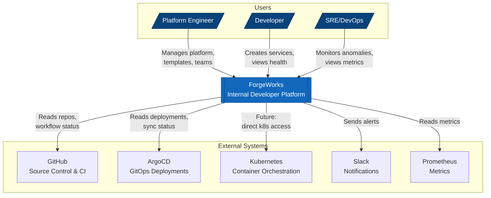

---

## 2. Container Diagram (C4 Level 2)

Shows the high-level technical architecture and main containers.

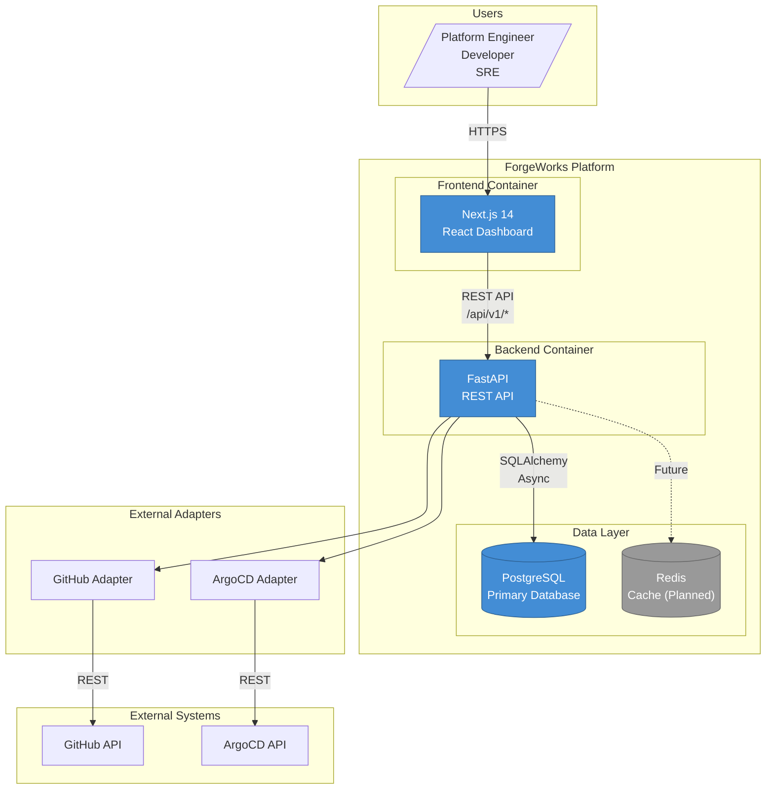

---

## 3. Component Diagram - Backend (C4 Level 3)

Detailed view of backend components.

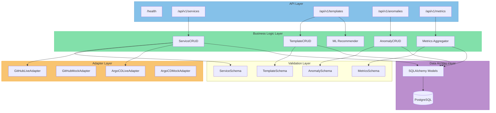

---

## 4. Component Diagram - Frontend

Detailed view of frontend layer architecture.

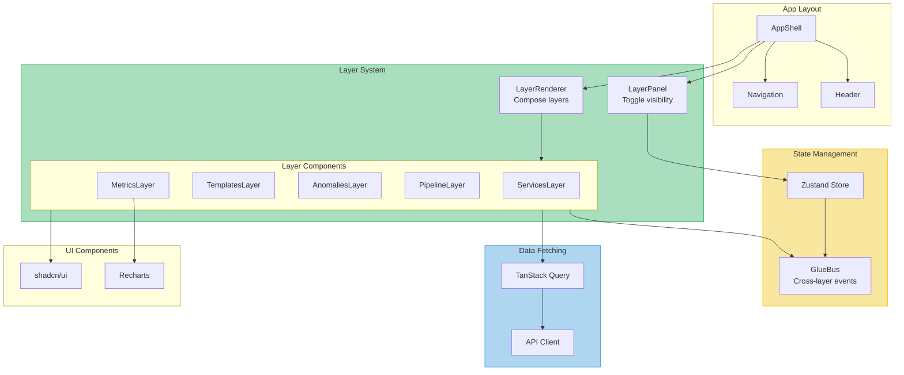

---

## 5. Data Flow Diagram

Shows how data flows through the system.

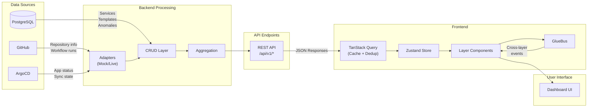

---

## 6. Deployment Diagram

Shows the deployment architecture for development and production.

### Local Development

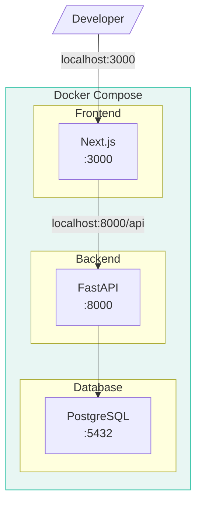

### Production (Target)

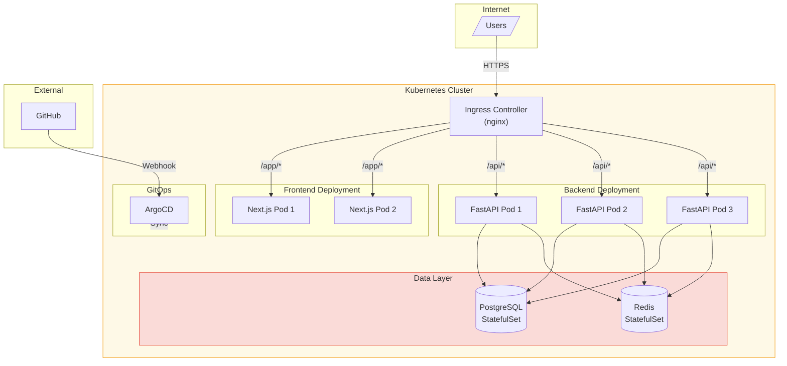

---

## 7. Sequence Diagrams

### Service Creation Flow

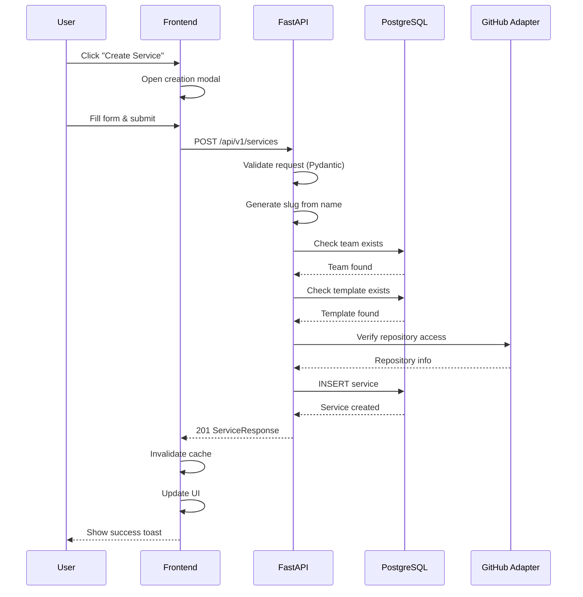

### Anomaly Detection Flow

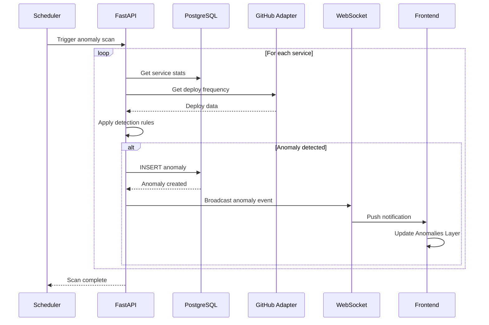

### Template Recommendation Flow

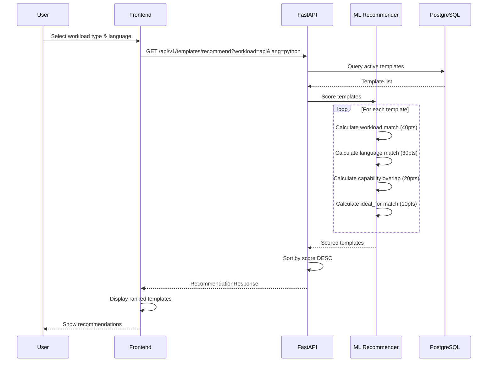

---

## 8. Entity Relationship Diagram

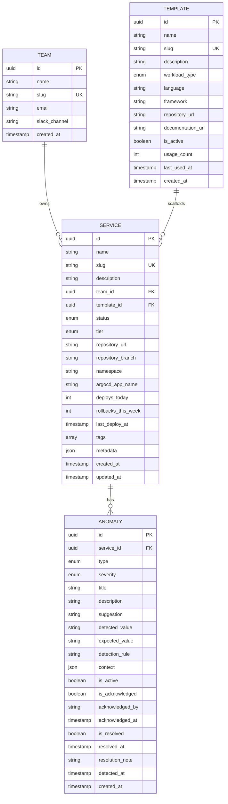

---

## 9. Layer Architecture Diagram

ForgeWorks unique layer-based UI composition.

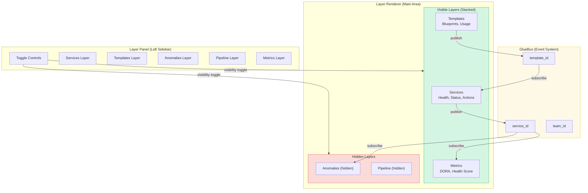

---

## 10. Adapter Pattern Diagram

Shows the Mock/Live adapter switching pattern.

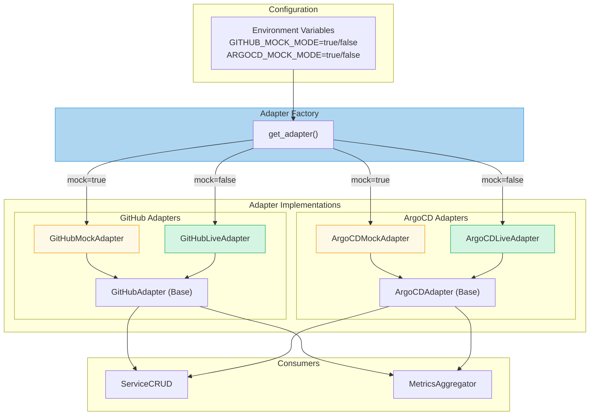

---

## Diagram Index

| # | Diagram | C4 Level | Description |
|---|---------|----------|-------------|
| 1 | System Context | L1 | High-level system and external actors |
| 2 | Container | L2 | Technical containers (Frontend, Backend, DB) |
| 3 | Component - Backend | L3 | Backend internal components |
| 4 | Component - Frontend | L3 | Frontend layer architecture |
| 5 | Data Flow | - | How data moves through the system |
| 6 | Deployment | - | Local and production deployment |
| 7 | Sequence | - | Key interaction flows |
| 8 | ERD | - | Database entity relationships |
| 9 | Layer Architecture | - | ForgeWorks unique UI pattern |
| 10 | Adapter Pattern | - | Mock/Live switching mechanism |

---

## Viewing Diagrams

### In GitHub

GitHub natively renders Mermaid diagrams in Markdown files.

### In VS Code

Install the [Markdown Preview Mermaid Support](https://marketplace.visualstudio.com/items?itemName=bierner.markdown-mermaid) extension.

### Mermaid Live Editor

Copy diagrams to [mermaid.live](https://mermaid.live/) for editing and PNG export.

---

*Last Updated: January 2025*
*Format: Mermaid Diagrams (C4 Model)*
